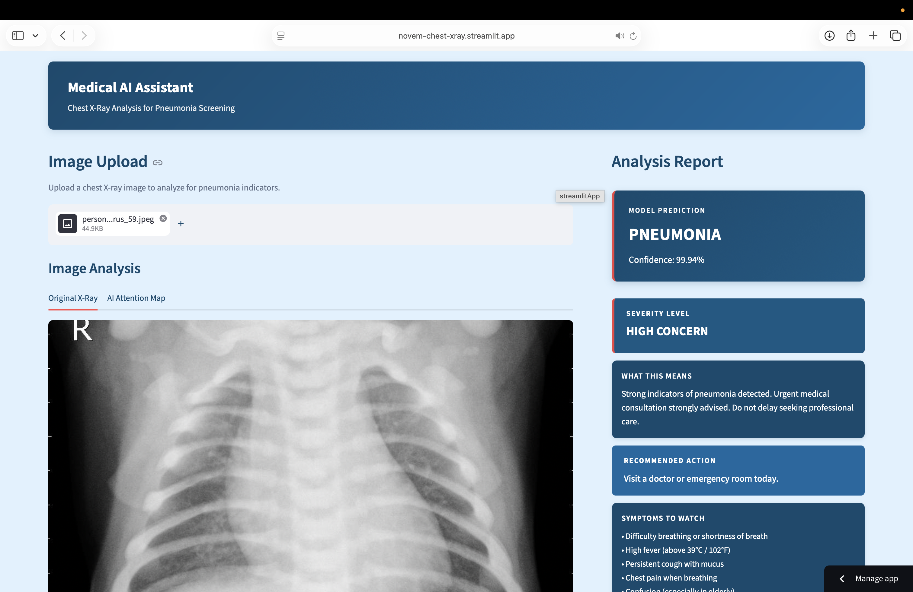
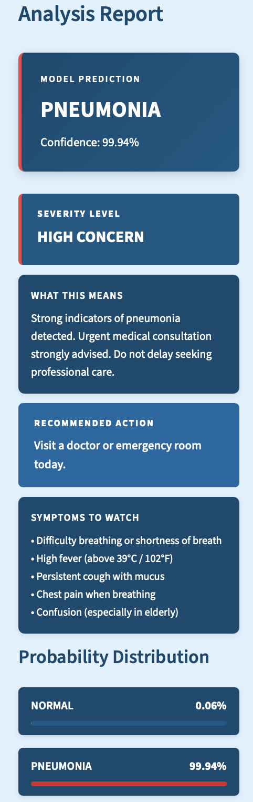
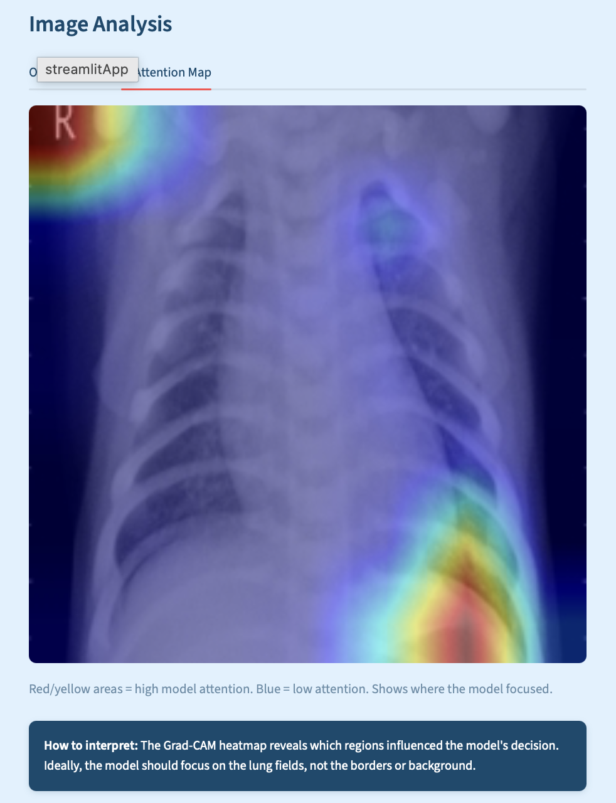
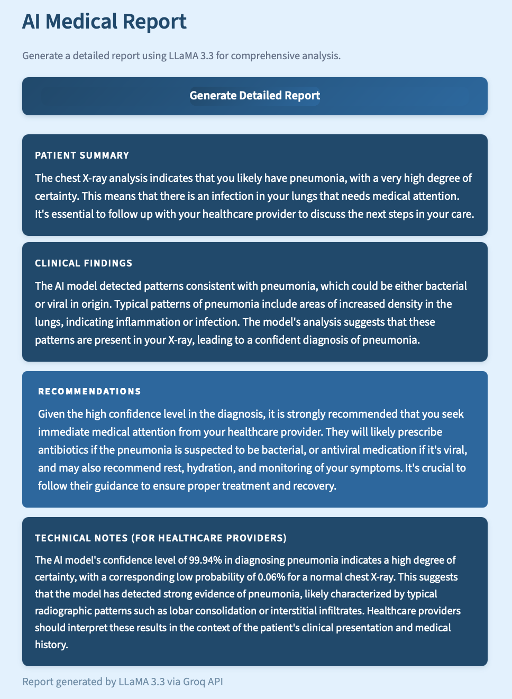
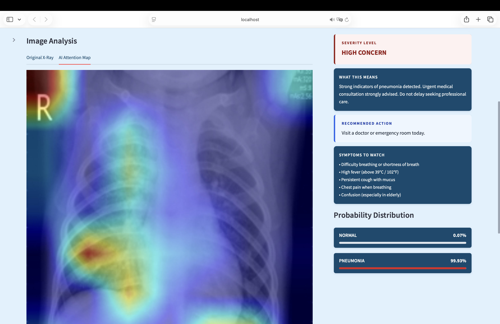

# Chest X-Ray Pneumonia Classifier


A deep learning-based medical AI assistant that detects pneumonia from chest X-ray images using ConvNeXt-Tiny, with Grad-CAM interpretability for clinical trust.

---

## Live Demo

Try the model live: **[Chest X-Ray Classifier on Streamlit](https://novem-chest-xray.streamlit.app)**

### Application Screenshots

**1. Home Interface**

Clean medical-grade interface with model information sidebar and upload area.



**2. Real-Time Diagnosis**

Instant pneumonia detection with severity levels, recommendations, and probability distribution.



**3. Grad-CAM Attention Visualization**

Interpretability layer showing which regions influenced the model's decision. The heatmap confirms the model focuses on clinically relevant lung areas.



**4. AI-Generated Medical Report**

Detailed report generated by LLaMA 3.3 via Groq API, providing patient-friendly summaries, clinical findings, and actionable recommendations.



### Key Features

- Real-time pneumonia detection from uploaded X-ray images
- Grad-CAM attention visualization showing where the model looks
- Severity-based clinical recommendations (High/Moderate/Low Concern)
- AI-generated medical reports powered by LLaMA 3.3
- Confidence-weighted actionable guidance

Run locally:
\`\`\`bash
streamlit run app.py
\`\`\`

---

## Project Overview

This project applies transfer learning to classify chest X-ray images as NORMAL or PNEUMONIA. Beyond classification, it emphasizes model interpretability through Grad-CAM visualization, allowing users to see which regions influenced the model's decision. This is critical for medical AI applications where trust and transparency are essential.

---

## Key Features

**Deep Learning Model**
- ConvNeXt-Tiny architecture pretrained on ImageNet
- Fine-tuned on Kaggle Chest X-Ray Dataset
- Class-weighted loss to address 1:3 data imbalance

**Interpretability**
- Grad-CAM heatmap visualization
- Shows model attention overlay on original X-ray
- Helps validate that model focuses on lung fields, not artifacts

**Clinical Recommendations**
- Severity levels: High/Moderate/Low Concern
- Confidence-based actionable guidance
- Symptoms to watch checklist
- Clear disclaimer for educational use

**Deployment**
- Live web application on Streamlit Community Cloud
- Model weights hosted on Hugging Face Hub
- No local installation required to use

---

## Results

### Test Set Performance (624 images)

| Class | Precision | Recall | F1-Score |
|-------|-----------|--------|----------|
| NORMAL | 0.99 | 0.50 | 0.67 |
| PNEUMONIA | 0.77 | 1.00 | 0.87 |
| Overall Accuracy | | | 81% |


### Model Interpretability

The Grad-CAM visualization confirms the model focuses on clinically relevant regions:



In this example, the model correctly focuses attention on the lower lung fields (highlighted in red/yellow), which is where pneumonia consolidation typically appears clinically. This alignment between model attention and clinical relevance provides confidence that the model is learning meaningful features rather than spurious correlations from image artifacts or borders.

**Color interpretation:**
- Red/Yellow: High attention (decision-influencing regions)
- Green: Moderate attention
- Blue: Low attention (ignored regions)

---

## Experimentation Log

### v1: Baseline (ConvNeXt-Tiny, no class weighting)

- Test Accuracy: 88.46%
- NORMAL Recall: 70%
- PNEUMONIA Recall: 99%
- Observation: Model over-predicts pneumonia due to 1:3 class imbalance

### v2: Weighted Loss with Proper Validation Split

- Validation Accuracy: 97.83% (on held-out 15% split from training set)
- Test Accuracy: 81%
- PNEUMONIA Recall: 100%
- Observation: Large gap between validation (97.83%) and test (81%) indicates significant distribution shift between training and test sets

### v3: Interpretability Layer

- Added Grad-CAM visualization
- Verified model attention aligns with lung fields
- Deployed live web application

### Key Findings

The Kaggle test set appears to come from a different patient cohort than the training set, causing a performance gap that internal validation does not reveal. This is a well-known challenge in medical AI called domain shift. High validation accuracy does not guarantee real-world performance, and independent test evaluation with interpretability tools like Grad-CAM are essential for trust.

---

## Tech Stack

- Language: Python 3.13
- Framework: PyTorch
- Model: ConvNeXt-Tiny (pretrained on ImageNet)
- Interpretability: Grad-CAM
- Web App: Streamlit
- Model Hosting: Hugging Face Hub
- Hardware Support: Apple Silicon (MPS) / CUDA / CPU

---

## Training Configuration

| Hyperparameter | Value |
|----------------|-------|
| Model | ConvNeXt-Tiny |
| Batch Size | 32 |
| Epochs | 5 |
| Learning Rate | 1e-4 |
| Optimizer | AdamW |
| Loss Function | Weighted Cross Entropy |
| Image Size | 224 × 224 |

---

## Dataset

- Source: [Kaggle Chest X-Ray Images (Pneumonia)](https://www.kaggle.com/datasets/paultimothymooney/chest-xray-pneumonia)
- Total Images: 5,856
- Classes: NORMAL, PNEUMONIA

| Split | NORMAL | PNEUMONIA | Total |
|-------|--------|-----------|-------|
| Train | 1,140 | 3,294 | 4,434 |
| Validation (custom 15% split) | 201 | 581 | 782 |
| Test | 234 | 390 | 624 |

Note: The original Kaggle validation set contains only 16 images, which is insufficient for reliable validation. A custom 15% split from the training data was created.

---

## Project Structure
chest-xray-classifier/
├── src/
│   ├── train.py              # Training script with weighted loss
│   ├── split_data.py         # Creates validation split from training data
│   ├── check_accuracy.py     # Quick model evaluation
│   ├── evaluate_full.py      # Full evaluation with confusion matrix
│   ├── inference.py          # Single image prediction
│   ├── gradcam.py            # Grad-CAM implementation
│   └── model.py              # Model architecture
├── results/
│   ├── best_model.pth        # Trained model weights (hosted on Hugging Face)
│   ├── confusion_matrix.png
│   ├── classification_report.json
│   ├── metrics.json
│   ├── training_log.txt
│   ├── demo_heatmap.png
│   ├── demo_pneumonia.png
│   └── demo_normal.png
├── data/                     # Dataset (not tracked)
├── app.py                    # Streamlit web application
├── requirements.txt
├── LICENSE
├── MODEL_CARD.md
├── CHANGELOG.md
└── README.md

---

## How to Run Locally

### 1. Clone the repository

```bash
git clone https://github.com/minthukyaw488-commits/chest-xray-classifier.git
cd chest-xray-classifier
```

### 2. Install dependencies

```bash
pip install -r requirements.txt
```

### 3. Download the dataset

Download from [Kaggle](https://www.kaggle.com/datasets/paultimothymooney/chest-xray-pneumonia) and extract to `data/chest_xray/`.

### 4. Create validation split

```bash
python src/split_data.py
```

### 5. Train the model

```bash
python src/train.py
```

### 6. Evaluate on the test set

```bash
python src/evaluate_full.py
```

### 7. Launch the web application

```bash
streamlit run app.py
```

The model weights will be automatically downloaded from Hugging Face on first run.

---

## Model Weights

Pretrained model weights are hosted on Hugging Face:
[novemtk18/chest-xray-classifier](https://huggingface.co/novemtk18/chest-xray-classifier)

---

## Known Limitations

- Significant class imbalance in training data (1:3 NORMAL to PNEUMONIA ratio)
- Distribution shift between training and test sets reduces real-world performance
- The model has not been validated on external datasets such as NIH ChestX-ray14 or CheXpert
- Trained on a single dataset, limiting generalizability to different hospital populations
- Cannot distinguish between bacterial and viral pneumonia

---

## Future Work

- Implement WeightedRandomSampler as an alternative to weighted loss
- Quantify and visualize the distribution shift between train and test sets
- Add stronger data augmentation strategies (CutMix, MixUp) to improve generalization
- Benchmark against other architectures (ResNet50, EfficientNet, DenseNet)
- Validate on external datasets to assess generalizability
- Add multi-language support (English, Korean, Burmese)
- Generate downloadable PDF reports for each analysis

---

## Disclaimer

This project is for educational and research purposes only. It is not intended for clinical use, diagnosis, or treatment decisions. Any medical AI system requires extensive validation, regulatory approval, and clinical oversight before real-world deployment. Always consult qualified healthcare professionals for medical advice.

---

## Author

**NOVEM (Min Thu Kyaw)**
Medical AI Student
Konyang University, Daejeon, South Korea

- GitHub: [@minthukyaw488-commits](https://github.com/minthukyaw488-commits)
- Hugging Face: [@novemtk18](https://huggingface.co/novemtk18)

---

## License

This project is released under the MIT License. See [LICENSE](LICENSE) for details.
The dataset license follows the original Kaggle terms.