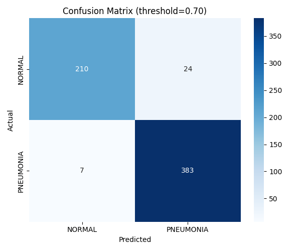

# 🫁 Chest X-Ray Pneumonia Classifier

A deep learning model that detects pneumonia from chest X-ray images using **ConvNeXt-Tiny**, built with PyTorch.

---

## 🎯 Project Overview

This project applies transfer learning to classify chest X-ray images as **NORMAL** or **PNEUMONIA**. The goal is to demonstrate how modern CNN architectures can support medical screening by detecting pneumonia with high sensitivity.

## 📊 Results

### Test Set Performance (624 images)

| Class | Precision | Recall | F1-Score |
|-------|-----------|--------|----------|
| NORMAL | 0.99 | 0.70 | 0.82 |
| PNEUMONIA | 0.85 | 0.99 | 0.92 |
| **Overall Accuracy** | | | **88.46%** |



### Clinical Interpretation

The model prioritizes **high sensitivity for pneumonia detection** (99% recall), meaning it rarely misses a real pneumonia case. This comes at the cost of some false positives on normal cases (30%), which is acceptable for a screening tool where missing a true positive has higher clinical risk than a false alarm.

---

## 🛠️ Tech Stack

- **Language:** Python 3.13
- **Framework:** PyTorch
- **Model:** ConvNeXt-Tiny (pretrained on ImageNet)
- **Hardware:** Apple Silicon (MPS) / CUDA / CPU
- **Libraries:** torchvision, scikit-learn, matplotlib, seaborn

---

## 📁 Project Structure
chest-xray-classifier/
├── src/
│   ├── train.py              # Training script
│   ├── check_accuracy.py     # Quick model evaluation
│   ├── evaluate_full.py      # Full evaluation with confusion matrix
│   └── model.py              # Model architecture
├── results/
│   ├── confusion_matrix.png  # Visualization
│   ├── metrics.json          # Performance metrics
│   └── classification_report.json
├── data/                     # Dataset (not tracked in git)
├── requirements.txt
└── README.md

---

## 📦 Dataset

- **Source:** [Kaggle Chest X-Ray Images (Pneumonia)](https://www.kaggle.com/datasets/paultimothymooney/chest-xray-pneumonia)
- **Total Images:** 5,856
- **Classes:** NORMAL, PNEUMONIA

| Split | NORMAL | PNEUMONIA | Total |
|-------|--------|-----------|-------|
| Train | 1,341 | 3,875 | 5,216 |
| Val | 8 | 8 | 16 |
| Test | 234 | 390 | 624 |

---

## 🚀 How to Run

### 1. Clone the repository
```bash
git clone https://github.com/minthukyaw488-commits/chest-xray-classifier.git
cd chest-xray-classifier
```

### 2. Install dependencies
```bash
pip install -r requirements.txt
```

### 3. Download dataset
Download from [Kaggle](https://www.kaggle.com/datasets/paultimothymooney/chest-xray-pneumonia) and place in `data/chest_xray/`.

### 4. Train the model
```bash
python src/train.py
```

### 5. Evaluate
```bash
python src/evaluate_full.py
```

---

## ⚙️ Training Configuration

| Hyperparameter | Value |
|----------------|-------|
| Model | ConvNeXt-Tiny |
| Batch Size | 32 |
| Epochs | 5 |
| Learning Rate | 1e-4 |
| Optimizer | AdamW |
| Loss | Cross Entropy |
| Image Size | 224 × 224 |

---

## ⚠️ Known Limitations

- **Class imbalance** in training data (1:3 NORMAL to PNEUMONIA ratio)
- Kaggle's default validation set is too small (only 16 images) for reliable validation
- The model has not been validated on external datasets

## 🔮 Future Work

- [ ] Address class imbalance with weighted loss or oversampling
- [ ] Create proper validation split from training data
- [ ] Build Streamlit web demo for live predictions
- [ ] Compare with other architectures (ResNet50, EfficientNet)
- [ ] Add Grad-CAM visualization for model interpretability
- [ ] Develop Android app for on-device inference

---

## 👤 Author

**NOVEM** — Medical AI Student
📍 Daejeon, South Korea
---

## 📜 License

This project is for educational purposes. Dataset license follows the original Kaggle terms.
