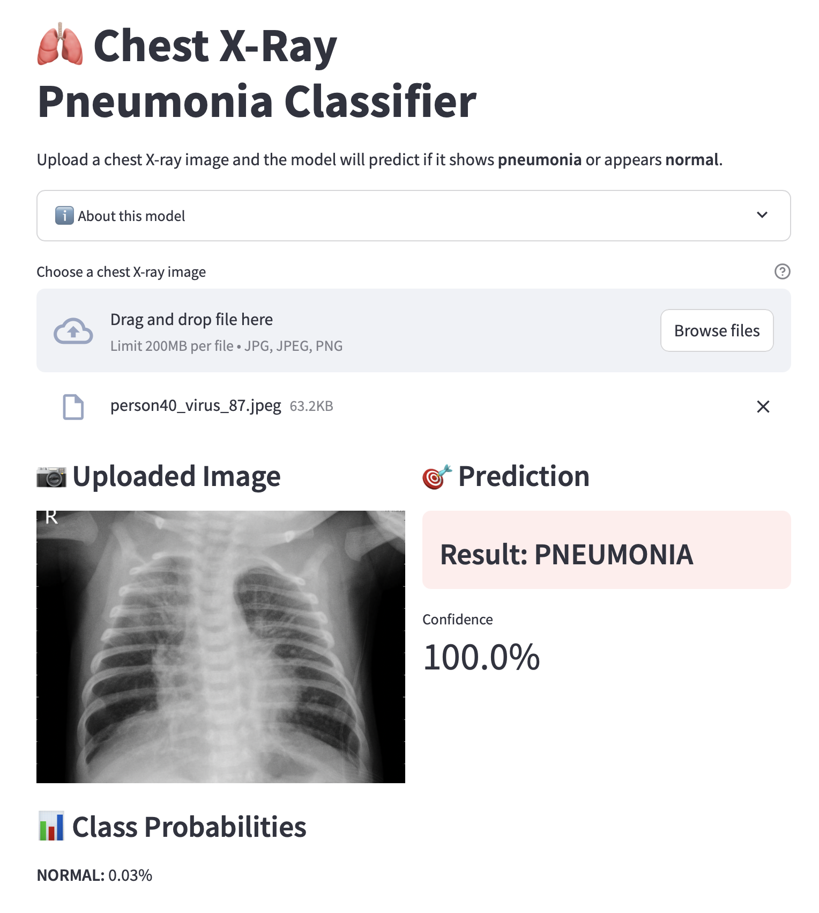

# Chest X-Ray Pneumonia Classifier

A deep learning model that detects pneumonia from chest X-ray images using ConvNeXt-Tiny, built with PyTorch.

---

## Project Overview

This project applies transfer learning to classify chest X-ray images as NORMAL or PNEUMONIA. It demonstrates how modern CNN architectures can support medical screening tasks and explores the challenges of class imbalance and distribution shift in medical AI.

---

## Live Demo

A Streamlit web application allows uploading X-ray images for live prediction.



Run locally:
```bash
streamlit run app.py
```

---

## Results

### Final Model Performance (Test Set: 624 images)

| Class | Precision | Recall | F1-Score |
|-------|-----------|--------|----------|
| NORMAL | 0.99 | 0.50 | 0.67 |
| PNEUMONIA | 0.77 | 1.00 | 0.87 |
| Overall Accuracy | | | 81% |


---

## Experimentation Log

### v1: Baseline (ConvNeXt-Tiny, no class weighting)

- Test Accuracy: 88.46%
- NORMAL Recall: 70%
- PNEUMONIA Recall: 99%
- Observation: Model over-predicts pneumonia due to a 1:3 class imbalance in training data

### v2: Weighted Loss with Proper Validation Split

- Validation Accuracy: 97.83% (on held-out 15% split from training set)
- Test Accuracy: 81%
- NORMAL Recall: 50%
- PNEUMONIA Recall: 100%
- Observation: A large gap between validation (97.83%) and test (81%) accuracy suggests significant distribution shift between training and test sets

### Key Findings

The Kaggle test set appears to come from a different patient cohort than the training set, causing a performance gap that internal validation does not reveal. Class weighting addressed the imbalance during training but did not generalize well to the test distribution, indicating that data-level interventions alone are insufficient when train and test distributions differ.

This experiment highlights an important principle in medical AI: high validation accuracy does not guarantee real-world performance. Independent test evaluation and external validation are essential.

---

## Tech Stack

- Language: Python 3.13
- Framework: PyTorch
- Model: ConvNeXt-Tiny (pretrained on ImageNet)
- Hardware: Apple Silicon (MPS) / CUDA / CPU
- Libraries: torchvision, scikit-learn, matplotlib, seaborn, streamlit

---

## Training Configuration

| Hyperparameter | Value |
|----------------|-------|
| Model | ConvNeXt-Tiny |
| Batch Size | 32 |
| Epochs | 5 |
| Learning Rate | 1e-4 |
| Optimizer | AdamW |
| Loss Function | Weighted Cross Entropy |
| Image Size | 224 × 224 |

---

## Dataset

- Source: [Kaggle Chest X-Ray Images (Pneumonia)](https://www.kaggle.com/datasets/paultimothymooney/chest-xray-pneumonia)
- Total Images: 5,856
- Classes: NORMAL, PNEUMONIA

| Split | NORMAL | PNEUMONIA | Total |
|-------|--------|-----------|-------|
| Train | 1,140 | 3,294 | 4,434 |
| Validation (custom 15% split) | 201 | 581 | 782 |
| Test | 234 | 390 | 624 |

Note: The original Kaggle validation set contains only 16 images, which is insufficient for reliable validation. A custom 15% split from the training data was created.

---

## Project Structure
chest-xray-classifier/

├── src/

│   ├── train.py              # Training script with weighted loss

│   ├── split_data.py         # Creates validation split from training data

│   ├── check_accuracy.py     # Quick model evaluation

│   ├── evaluate_full.py      # Full evaluation with confusion matrix

│   ├── inference.py          # Single image prediction

│   └── model.py              # Model architecture

├── results/

│   ├── best_model.pth        # Trained model weights (not tracked)

│   ├── confusion_matrix.png

│   ├── classification_report.json

│   ├── metrics.json

│   ├── training_log.txt

│   └── demo_pneumonia.png

├── data/                     # Dataset (not tracked)

├── app.py                    # Streamlit demo application

├── requirements.txt

└── README.md
---

## How to Run

### 1. Clone the repository

```bash
git clone https://github.com/minthukyaw488-commits/chest-xray-classifier.git
cd chest-xray-classifier
```

### 2. Install dependencies

```bash
pip install -r requirements.txt
```

### 3. Download the dataset

Download from [Kaggle](https://www.kaggle.com/datasets/paultimothymooney/chest-xray-pneumonia) and extract to `data/chest_xray/`.

### 4. Create validation split

```bash
python src/split_data.py
```

### 5. Train the model

```bash
python src/train.py
```

### 6. Evaluate on the test set

```bash
python src/evaluate_full.py
```

### 7. Launch the Streamlit demo

```bash
streamlit run app.py
```

---

## Known Limitations

- Significant class imbalance in training data (1:3 NORMAL to PNEUMONIA ratio)
- Distribution shift between training and test sets reduces real-world performance
- The model has not been validated on external datasets such as NIH ChestX-ray14 or CheXpert
- Trained on a single dataset, limiting generalizability to other hospital populations

---

## Future Work

- Implement WeightedRandomSampler as an alternative to weighted loss
- Quantify and visualize the distribution shift between train and test sets
- Add stronger data augmentation strategies (CutMix, MixUp) to improve generalization
- Implement Grad-CAM for model interpretability and clinical trust
- Deploy the Streamlit demo to Streamlit Community Cloud for public access
- Benchmark against other architectures (ResNet50, EfficientNet, DenseNet)
- Validate on external datasets to assess generalizability

---

## Disclaimer

This project is for educational and research purposes only. It is not intended for clinical use, diagnosis, or treatment decisions. Any medical AI system requires extensive validation, regulatory approval, and clinical oversight before real-world deployment.

---

## Author

NOVEM — Medical AI Student

---

## License

This project is released for educational purposes. The dataset license follows the original Kaggle terms.